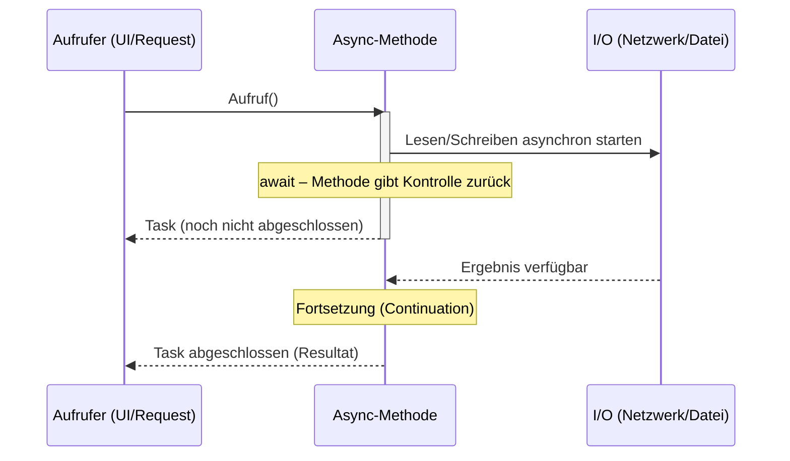

# Asynchron in .NET

## Kernidee von async/await
- async/await vereinfacht asynchrone, nicht-blockierende Abläufe.
- Wichtiger Punkt: async bedeutet nicht automatisch „neuer Thread“. Meist wird kein zusätzlicher Thread gestartet.
- await pausiert die Methode, gibt die Kontrolle frei und setzt später fort, wenn das Ergebnis da ist.
- Besonders sinnvoll bei I/O-gebundenen Arbeiten (Netzwerk, Dateisystem, Datenbank), damit Threads nicht blockieren.

### Sequenz: I/O-gebundenes await (kein zusätzlicher Thread notwendig)

Hinweis: Es wird kein zusätzlicher Thread für das Warten benötigt. Der Aufrufer-Thread bleibt frei für andere Arbeit (z. B. UI-Interaktion, weitere Requests).

## Async ist nicht gleich Multithreading
- Async/await modelliert „Warten ohne Blockieren“, nicht „Berechnung auf mehreren Threads“.
- I/O-Operationen brauchen primär Zeit, nicht CPU. Während des Wartens sollte kein Thread blockieren.
- Multithreading verteilt CPU-Arbeit auf mehrere Threads/CPU-Kerne. Das erreichst du nicht automatisch mit await.
- Fortsetzungen (nach await) laufen standardmäßig im aktuellen Synchronisationskontext weiter (z. B. UI-Thread), außer man nutzt ConfigureAwait(false) oder es gibt keinen Kontext (ASP.NET Core).

## Was macht Task.Run?
- Task.Run startet eine Arbeit im ThreadPool (neuer Hintergrund-Thread aus dem Pool).
- Geeignet für CPU-gebundene Arbeit, wenn der aktuelle Thread nicht blockiert werden darf (z. B. UI-Thread).
- Nicht geeignet als „Allzweck-Async-Schalter“. Für I/O-gebundene Arbeit bringt Task.Run keinen Vorteil und erzeugt unnötige Threads/Overhead.
- In ASP.NET Core ist Task.Run selten nötig; der Request-Thread ist kein UI-Thread und sollte durch asynchrone I/O-Aufrufe frei bleiben.

### Kurzbeispiele
- I/O-bound (ohne Task.Run):
  - await httpClient.GetStringAsync(uri)
- CPU-bound (mit Task.Run, z. B. im UI-Kontext):
  - var result = await Task.Run(() => TeureBerechnung(eingabe))

## Best Practices
- Bei I/O: immer native Async-APIs nutzen und awaiten; keine .Result/.Wait().
- Bibliothekscode: ConfigureAwait(false) verwenden, um Synchronisationskontexte nicht einzufangen.
- Task.Run nur für CPU-arbeitende Abschnitte einsetzen, nicht für I/O.
- CancellationToken anbieten und respektieren.
- Exceptions nicht verschlucken; in async-Methoden Task statt async void verwenden (außer Event-Handler).
- ValueTask nur gezielt für synchrone Schnellpfade/API-Hotpaths verwenden.

## Weiterführende Ressourcen
- Asynchronous programming with async and await: https://learn.microsoft.com/dotnet/csharp/asynchronous-programming/
- Async/Await best practices: https://learn.microsoft.com/dotnet/standard/async-in-depth
- ConfigureAwait FAQ: https://devblogs.microsoft.com/dotnet/configureawait-faq/
- ThreadPool & Task.Run: https://learn.microsoft.com/dotnet/standard/threading/the-managed-thread-pool
