# Best Practices für NuGet Paketmanagement in komplexen .NET-Projekten

## Ziele
- Einheitliche, reproduzierbare Builds
- Geringere Wartungskosten und klare Verantwortlichkeiten
- Sicherheit und Compliance sicherstellen

## Zentrales Paketmanagement (CPM)
- Eine Directory.Packages.props im Lösungsstamm nutzen.
- In Projektdateien keine Versionen angeben
- Vorteile: konsistente Versionen, weniger Mergekonflikte, einfachere Updates.

Beispiel Directory.Packages.props:
```xml
<Project>
  <PropertyGroup>
    <ManagePackageVersionsCentrally>true</ManagePackageVersionsCentrally>
  </PropertyGroup>
  <ItemGroup>
    <PackageVersion Include="Microsoft.Extensions.Configuration" Version="9.0.9" />
    <!-- weitere zentrale Versionen -->
  </ItemGroup>
</Project>
```

Projektdatei:
```xml
<ItemGroup>
  <PackageReference Include="Microsoft.Extensions.Configuration" />
</ItemGroup>
```

Projektspezifische Abweichung (nur im Ausnahmefall):
```xml
<ItemGroup>
  <PackageReference Include="Paket" VersionOverride="1.2.3" />
</ItemGroup>
```

## Versionierungsstrategie
- Fixe, explizite Versionen in Directory.Packages.props; keine Floating-Versionen (1.2.*)
- Regelmäßige, gebündelte Updates (z. B. ein mal pro Sprint einplannen)
- Major Upgrades isoliert testen; Upgrades als einzelnes PR.

## Transitive Abhängigkeiten
- Wenn möglich transitive Pinning aktivieren, um Build-Drift zu vermeiden.

```mermaid
graph TD
    A["🔷 Mein Projekt"]
    B["📦 Package A<br/>v1.2.3"]
    C["📦 Package B<br/>v4.*"]
    
    A -->|references| B
    B -->|references| C
    
    style A fill:#e1f5ff
    style B fill:#fff3e0
    style C fill:#f3e5f5
```



## PrivateAssets/IncludeAssets
- Entwicklungs-/Test-Pakete nicht weitertransitiv machen:
```xml
<ItemGroup>
  <PackageReference Include="xunit" PrivateAssets="all" />
  <PackageReference Include="Microsoft.NET.Test.Sdk" PrivateAssets="all" />
  <PackageReference Include="coverlet.collector" PrivateAssets="all" />
</ItemGroup>
```
- Analyzer/Source-Generatoren ebenfalls PrivateAssets="all" setzen.

## Shared Framework vs. NuGet
- Web-/Host-Projekte: FrameworkReference Microsoft.AspNetCore.App verwenden, keine Pakete duplizieren, die im Shared Framework enthalten sind.
```xml
<ItemGroup>
  <FrameworkReference Include="Microsoft.AspNetCore.App" />
</ItemGroup>
```
- Bibliotheken: Keine Abhängigkeit vom Shared Framework erzwingen; nur wirklich benötigte NuGet-Pakete referenzieren.

## Sicherheit und Compliance
- Vulnerability Checks ernst nehmen:
  - dotnet list package --vulnerable oder Warnungen in VS
  - Security Warnungen (NU19xx) als Fehler behandeln oder gesondert konfigurieren. Siehe auch: https://learn.microsoft.com/en-us/nuget/reference/errors-and-warnings/nu1901
- Abhängigkeiten signieren/verifizieren, wo möglich

## Reproduzierbarkeit und Nachvollziehbarkeit
- Lock-Dateien nutzen (packages.lock.json) 
  - <RestorePackagesWithLockFile>true</RestorePackagesWithLockFile>
  - dotnet restore --locked-mode im CI
- Nachteil: Lock-Datei muss manuell aktualisiert werden
- NuGet-Quellen zentral in NuGet.config definieren (auth, Mirroring, Cache-Strategie).

## CI/CD-Empfehlungen
- Restore separat cachen (NuGet-Cache/Artifacts).
- NuGet-Warnungen streng behandeln (z. B. WarningsAsErrors für NU* im CI).
- eventuell: automatisierte Update Jobs (z. B. wöchentlich/monatlich) zur Pflege der Versionen in Directory.Packages.props einsetzen

## Migrationsleitfaden (kurz)
1. Alle csproj nach PackageReference mit Version scannen.
2. Directory.Packages.props anlegen und Versionen als PackageVersion eintragen.
3. Version-Attribute in csproj entfernen.
4. Build testen, ggf. Konflikte mit Shared Framework beheben.
5. Unnötige Pakete entfernen

## Troubleshooting
- NU1008: Versionen noch in csproj definiert → löschen, in Directory.Packages.props pflegen.
- Versionskonflikte: Transitive Pakete identifizieren (dotnet list package) und zentral pinnen.
- ASP.NET Core Konflikte: FrameworkReference verwenden, keine redundanten Microsoft.Extensions.* Pakete.

